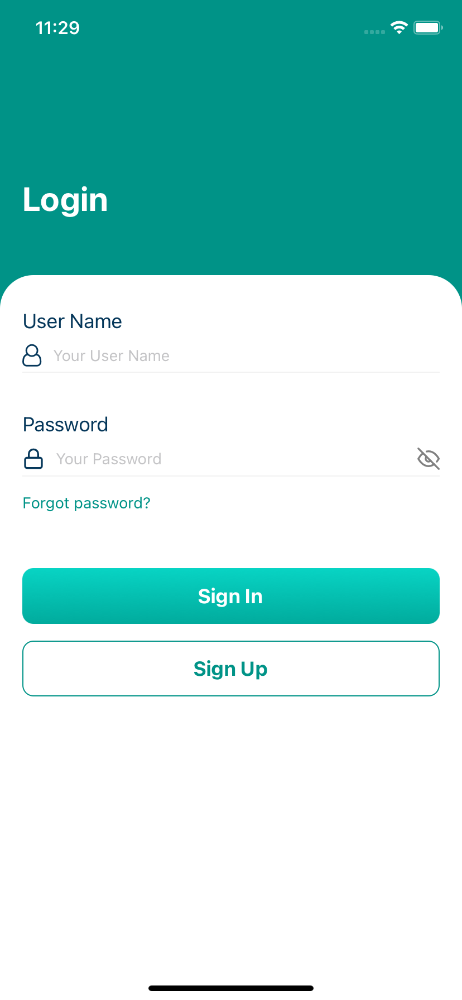
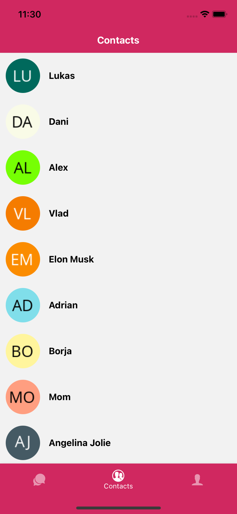
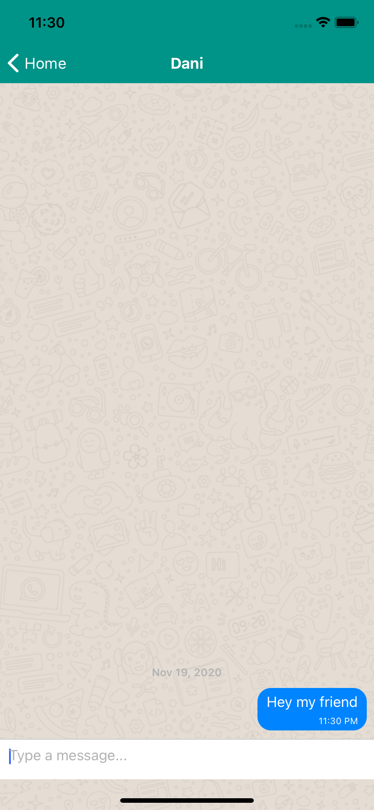
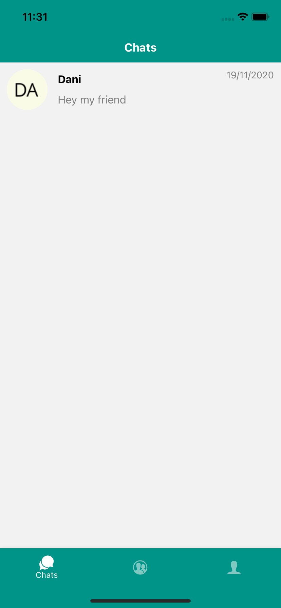

# React Native Chat
Coding Challenge to build a simple react native chat app

The basic requirements of the app:

* Login screen (accounts can be hard coded in the app as JSON files)
* Contacts screen (all data can be hard coded as JSON files)
* Must be possible to select a contact and exchange messages with them
* If the app is terminated and relaunched the chat history must still be there

## Prerequisites
You should have following software / executable files installed and are available via command line:
* Node.js ( >= 14.x )
* Expo SDK ( = 29.x )
* Yarn
* Expo-cli

## Demo
To get the project code:
```
git clone https://github.com/YangtaoGe518/react-native-chat.git
```
To run the demo:
```
cd react-native-chat/
yarn install
yarn start
```

The Expo Metro bundler will automatically start on your web browser

The account is hardcode:
* username: admin
* password: adminadmin

## App Walks Through
* Login Screen 


* Contacts


* Chat Room


* Active Chat List


